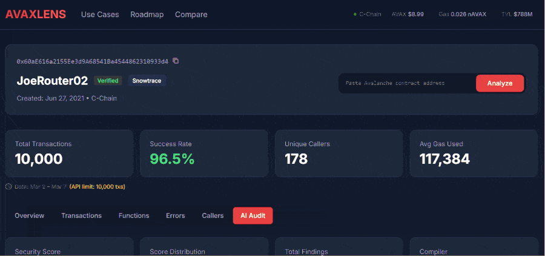

# AvaxLens

**Free smart contract analytics for Avalanche C-Chain.**

Paste any contract address — get instant analytics: transaction volume, gas usage, function breakdown, error logs, caller analysis, AI security audits, and live network stats. No signup. No API key. No cost.

**Live:** [avaxlens.vercel.app](https://avaxlens.vercel.app)



---

## How It Works

1. **Paste** any C-Chain contract address into the search bar
2. **AvaxLens fetches** transaction history from Routescan + contract ABI from Snowtrace
3. **Server processes** up to 10,000 transactions: decodes function calls via viem, computes metrics, groups by day/function/caller
4. **Dashboard renders** pre-computed analytics (~2KB JSON) — charts, tables, and metrics load instantly

All processing happens server-side. The client receives ready-to-display data — no raw transaction parsing in the browser.

```
User → Next.js API Route → Snowtrace (ABI) + Routescan (txs) → viem decode → Analytics JSON → Dashboard
```

---

## Features

### 6 Dashboard Tabs

| Tab | What it shows |
|-----|---------------|
| **Overview** | Transaction volume charts, success/fail trend, gas metrics, top functions |
| **Transactions** | Paginated list with decoded function names, status filters, tx hash search |
| **Functions** | Call count charts, gas usage comparison, per-function success rates |
| **Errors** | Decoded revert reasons, error distribution, affected function mapping |
| **Callers** | Top callers ranked by activity, distribution charts, sortable tables |
| **AI Audit** | Security analysis with risk scoring (A-F grade), findings, recommendations |

### Platform Features

- **Live Network Stats** — AVAX price, gas price, TVL in header (DeFiLlama + C-Chain RPC, auto-refresh 30s)
- **Period Selection** — 7d / 30d time ranges with instant switching
- **CSV Export** — download analytics per tab as CSV file
- **Shareable Links** — share dashboard via URL with period and tab preserved
- **Contract Comparison** — side-by-side feature comparison with competitors
- **Recent Searches** — recently viewed contracts saved locally
- **Data Coverage** — shows actual date range and API limits transparently
- **Health Check** — live API status indicator in footer
- **Mobile Responsive** — all tables and charts work on mobile

### Security & Performance

- 3 independent security audits — **score 10/10**, 0 open findings
- React Query for client-side caching (dedup, background refetch, stale/fresh)
- Rate limiting (30 req/min per IP), 5 security headers (CSP, HSTS)
- Server-side LRU cache (ABI: 24h, analytics: 5min, transactions: 60s)
- Input/response validation, fetch timeouts on all external API calls

---

## Tech Stack

| Layer | Technology |
|-------|-----------|
| Framework | Next.js 16 (App Router, Turbopack) |
| Language | TypeScript 5 |
| Styling | Tailwind CSS 4 |
| Data Fetching | React Query (@tanstack/react-query) |
| Charts | Recharts (lazy-loaded, SSR-safe) |
| ABI Decoding | viem |
| Deployment | Vercel (auto-deploy from GitHub) |

## Data Sources

| API | Purpose | Rate Limit |
|-----|---------|------------|
| [Snowtrace](https://snowtrace.io) | Contract ABI, name, verification status | 2 req/sec |
| [Routescan](https://routescan.io) | Transaction history (up to 10k txs) | 2 req/sec |
| [DeFiLlama](https://defillama.com) | AVAX price, Avalanche TVL | No limit |
| [Avalanche RPC](https://api.avax.network) | Gas price (eth_gasPrice) | Public |

No API keys required. All APIs are free tier.

---

## Try It

Test with these verified contracts:

| Name | Address | Type |
|------|---------|------|
| Trader Joe | `0x60aE616a2155Ee3d9A68541Ba4544862310933d4` | DEX |
| Trader Joe V2 | `0xb4315e873dBcf96Ffd0acd8EA43f689D8c20fB30` | DEX |
| Aave V3 | `0x794a61358D6845594F94dc1DB02A252b5b4814aD` | Lending |
| WAVAX | `0xB31f66AA3C1e785363F0875A1B74E27b85FD66c7` | Token |

Or paste any C-Chain contract address at [avaxlens.vercel.app](https://avaxlens.vercel.app).

## Quick Start

```bash
npm install
npm run dev       # Dev server on localhost:3000
npm run build     # Production build
```

## Project Structure

```
src/
  app/                    # Next.js App Router pages + API routes
  lib/                    # Business logic, APIs, processing, cache, hooks
  components/             # React components (layout, dashboard, charts, tables, ui)
  data/                   # Static data (AI audit results)
```

## Team

Built by **Alex Vega** (development) and **Mark** (design & documentation) for [Avalanche Build Games 2026](https://www.avax.network/buildgames2026).

## License

MIT
